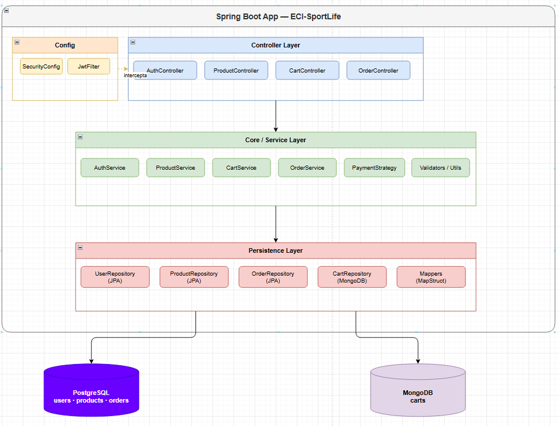
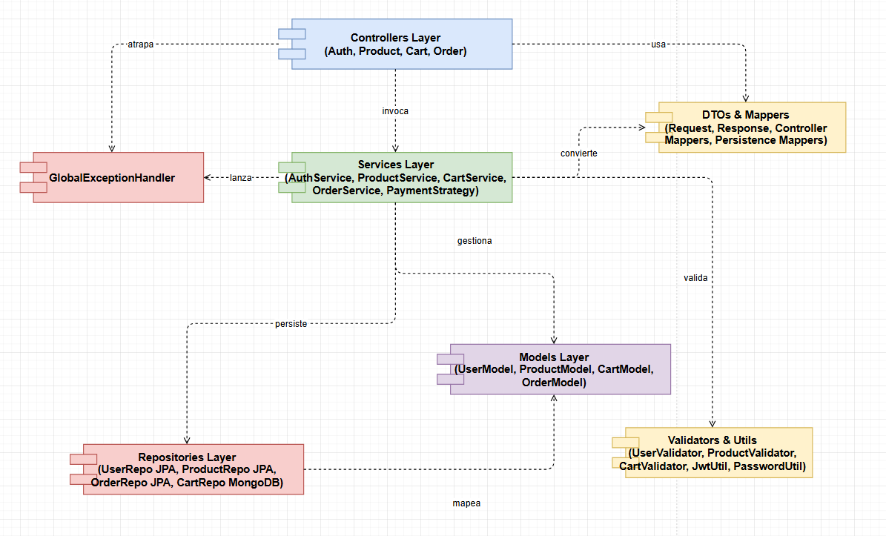

# ECI-SportLife API

API REST para tienda deportiva virtual desarrollada con Spring Boot 3.x, PostgreSQL y MongoDB.

---

## Descripción del proyecto

ECI-SportLife permite a los usuarios explorar un catálogo de productos deportivos, gestionar un carrito de compras persistido en MongoDB y realizar el proceso de pago generando una orden de compra en PostgreSQL. La autenticación se basa en JWT con roles USER y ADMIN.

---

## Stack tecnológico

| Tecnología | Uso |
|---|---|
| Java 17 | Lenguaje principal |
| Spring Boot 3.2 | Framework base |
| Maven | Gestión de dependencias |
| Spring Security + JWT (jjwt 0.11.5) | Autenticación y autorización |
| Spring Data JPA + PostgreSQL | Persistencia relacional (usuarios, productos, órdenes) |
| Spring Data MongoDB | Persistencia no relacional (carrito) |
| Lombok | Reducción de boilerplate |
| MapStruct | Mapeo entre capas |
| SpringDoc OpenAPI (Swagger) | Documentación interactiva |
| JUnit 5 + Mockito | Pruebas unitarias e integración |
| JaCoCo | Cobertura de código |
| SonarQube | Análisis estático de calidad |
| SLF4J + Logback | Logging |

---

## Matriz de trazabilidad

| ID | Funcionalidad | Endpoint | Rol | Autenticación |
|---|---|---|---|---|
| F1 | Registro de usuario | POST /api/auth/register | Público | No |
| F2 | Login de usuario | POST /api/auth/login | Público | No |
| F3 | Listar productos activos | GET /api/products | Público | No |
| F4 | Detalle de producto | GET /api/products/{id} | Público | No |
| F5 | Agregar ítem al carrito | POST /api/cart/items | USER | JWT |
| F6 | Ver carrito | GET /api/cart | USER | JWT |
| F7 | Checkout / Pago | POST /api/orders/checkout | USER | JWT |

---

## Endpoints

### F1 — POST /api/auth/register

Registra un nuevo usuario en el sistema.

- **Verbo:** POST — No idempotente (cada llamada puede crear un recurso distinto o fallar si el email ya existe)
- **Autenticación:** No requerida
- **Request:** name (String, obligatorio), email (String email válido, obligatorio), password (String min 8 chars, obligatorio)
- **Validaciones:** email formato válido y único, password ≥ 8 caracteres, name no vacío
- **Códigos HTTP:** 201 Created, 400 Bad Request, 409 Conflict

---

### F2 — POST /api/auth/login

Autentica un usuario y devuelve un token JWT.

- **Verbo:** POST — No idempotente (genera un nuevo token en cada llamada)
- **Autenticación:** No requerida
- **Request:** email (String, obligatorio), password (String, obligatorio)
- **Response:** token JWT + tipo Bearer
- **Códigos HTTP:** 200 OK, 400 Bad Request, 404 Not Found

---

### F3 — GET /api/products

Lista todos los productos activos con filtros opcionales.

- **Verbo:** GET — Idempotente: múltiples llamadas idénticas devuelven el mismo resultado sin efectos secundarios
- **Autenticación:** No requerida
- **Query Params:** category (opcional), name (opcional, búsqueda parcial)
- **Códigos HTTP:** 200 OK, 500 Internal Server Error

---

### F4 — GET /api/products/{id}

Devuelve el detalle de un producto por su UUID.

- **Verbo:** GET — Idempotente: leer un recurso no lo modifica
- **Autenticación:** No requerida
- **Path Variable:** id (UUID, obligatorio)
- **Códigos HTTP:** 200 OK, 404 Not Found

---

### F5 — POST /api/cart/items

Agrega un producto al carrito del usuario autenticado.

- **Verbo:** POST — No idempotente (llamadas repetidas suman la cantidad)
- **Autenticación:** JWT requerido
- **Request:** productId (UUID, obligatorio), quantity (Integer ≥ 1, obligatorio)
- **Validaciones:** producto existe y está ACTIVE, stock suficiente, quantity ≥ 1
- **Códigos HTTP:** 201 Created, 400 Bad Request, 401 Unauthorized, 404 Not Found

---

### F6 — GET /api/cart

Devuelve el resumen del carrito del usuario autenticado.

- **Verbo:** GET — Idempotente
- **Autenticación:** JWT requerido
- **Códigos HTTP:** 200 OK, 401 Unauthorized

---

### F7 — POST /api/orders/checkout

Procesa el pago del carrito y genera una orden de compra.

- **Verbo:** POST — No idempotente (crea una orden y vacía el carrito)
- **Autenticación:** JWT requerido
- **Request:** ninguno (usa el carrito del usuario autenticado)
- **Códigos HTTP:** 201 Created, 400 Bad Request, 401 Unauthorized, 402 Payment Required

---

## Diagrama de componentes general

---

## Diagrama de componentes específico

---

## Modelo relacional (PostgreSQL)

---

## Modelo no relacional (MongoDB)

El carrito se almacena como un único documento por usuario en MongoDB. Cada documento contiene un array de ítems embebidos (CartItem) con productId, productName, price, quantity y subtotal. Se usa MongoDB para el carrito porque el esquema es flexible, las operaciones de lectura y escritura son frecuentes, y no requiere integridad referencial estricta ya que se valida a nivel de servicio.

---

## Patrones de diseño implementados

| Patrón | Ubicación | Por qué |
|---|---|---|
| **Repository** | `persistence/repositories/` | Abstrae el acceso a datos; permite cambiar la implementación sin tocar la lógica de negocio |
| **DTO** | `controller/dtos/` | Desacopla la API pública de las entidades internas; evita exponer campos sensibles como password |
| **Strategy** | `core/services/PaymentStrategy` | Permite agregar nuevos métodos de pago (PayPal, PSE) sin modificar `OrderServiceImpl` |
| **Singleton** | `JwtUtil` (Spring `@Component`) | Spring garantiza una única instancia compartida; centraliza la lógica de tokens |
| **Mapper (MapStruct)** | `persistence/mappers/`, `controller/mappers/` | Convierte entre capas de forma segura en tiempo de compilación, sin reflexión en runtime |

---

## Seguridad

### JWT (JSON Web Token)
- Generado en login con expiración de 24 horas
- Firmado con HMAC-SHA256 usando clave secreta configurable
- Stateless: no requiere sesión en el servidor, escalable horizontalmente y portable entre microservicios

### BCrypt
- Contraseñas nunca almacenadas en texto plano
- Factor de trabajo adaptable mediante BCryptPasswordEncoder

### CORS
CORS (Cross-Origin Resource Sharing) es necesario porque el frontend se sirve desde un origen diferente al backend. Sin configurarlo, el navegador bloqueará las peticiones por política de mismo origen.

### TLS/SSL
En producción el tráfico debe estar cifrado con TLS (Transport Layer Security) configurado en el servidor (Nginx/Load Balancer) con certificados SSL, garantizando que el JWT viaje cifrado y no pueda ser interceptado.

### Roles y permisos

| Endpoint | Público | USER | ADMIN |
|---|---|---|---|
| POST /api/auth/register | ✓ | | |
| POST /api/auth/login | ✓ | | |
| GET /api/products | ✓ | | |
| GET /api/products/{id} | ✓ | | |
| POST /api/cart/items | | ✓ | ✓ |
| GET /api/cart | | ✓ | ✓ |
| POST /api/orders/checkout | | ✓ | ✓ |

---

## Instrucciones para correr el proyecto localmente

### Prerrequisitos
- Java 17+
- Maven 3.8+
- Docker (recomendado para bases de datos)

### Pasos
1. Levantar PostgreSQL en el puerto 5432 y MongoDB en el puerto 27017 (con Docker o instalación local)
2. Configurar las variables de entorno listadas en la sección siguiente
3. Ejecutar `mvn clean install -DskipTests` para compilar
4. Ejecutar `mvn spring-boot:run` para iniciar la aplicación
5. Acceder a la documentación Swagger en `http://localhost:8080/swagger-ui.html`
6. Ejecutar `mvn test` para correr las pruebas
7. Ver reporte de cobertura en `target/site/jacoco/index.html`

---

## Variables de entorno necesarias

| Variable | Descripción | Valor por defecto |
|---|---|---|
| `DB_URL` | URL JDBC de PostgreSQL | `jdbc:postgresql://localhost:5432/sportlife` |
| `DB_USERNAME` | Usuario de PostgreSQL | `postgres` |
| `DB_PASSWORD` | Contraseña de PostgreSQL | `postgres` |
| `MONGO_URI` | URI de conexión MongoDB | `mongodb://localhost:27017/sportlife` |
| `JWT_SECRET` | Clave secreta Base64 para firmar JWT | *(ver application.yaml)* |
| `JWT_EXPIRATION` | Tiempo de expiración del JWT en ms | `86400000` (24h) |
| `SONAR_TOKEN` | Token de autenticación SonarQube | *(requerido en CI)* |
| `SONAR_HOST_URL` | URL del servidor SonarQube | `http://localhost:9000` |
